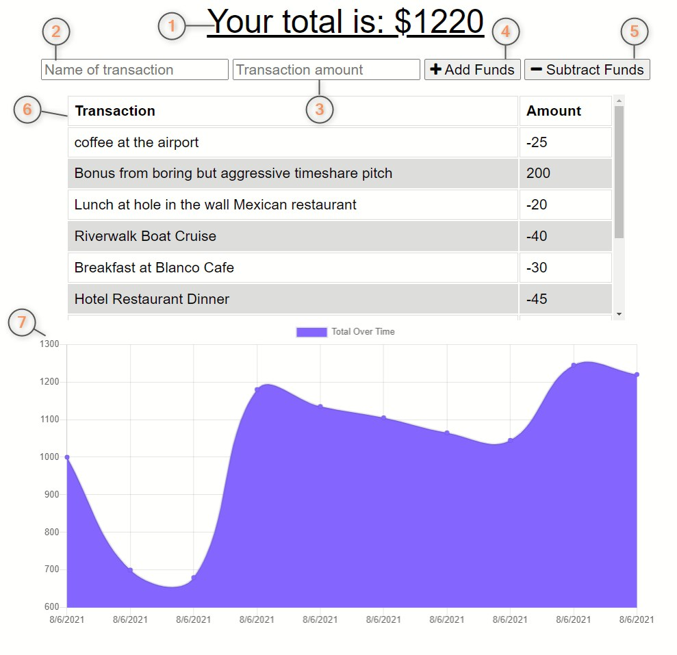
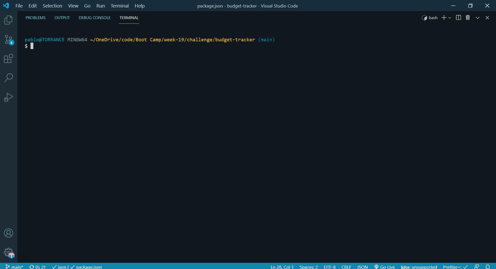

# budget-tracker

Click the following link to visit the deployed application: [**budget-tracker**](https://budget-tracker-pablodlc.herokuapp.com/).

Check out the YouTube video of **budget-tracker** in action by clicking the following link: [**budget-tracker**](https://www.youtube.com/watch?v=v0xPYAg_BtM).

## Table of Contents

-   [Description](#description)
-   [User Story](#user%20story)
-   [Acceptance Criteria](#acceptance%20criteria)
-   [Installation](#installation)
    -   [Installing **budget-tracker** as an app on a device](#installing-budget-tracker-as-an-app-on-a-device)
    -   [Installing **budget-tracker** dependencies for local instances](#installing-budget-tracker-dependencies-for-local-instances)
-   [Usage](#usage)
-   [Future Developments](#future%20developments)
-   [Questions?](#questions)

## Description

**budget-tracker** got that PWA! ⚡  
**P**rogressive **W**eb **A**pplications ("**PWA**s") are powerful sites with a ton of utility. Any website can be made into a **PWA** by a loving programmer. **PWA**s have two awesome features: The first of their strengths is that they're functional regardless of connectivity. The second is that they can be installed as an application to nearly any modern device the user may have.

**PWA**s work regardless of their connectivity by running self-calling functions to determine their connection status. The first time a device connects to a **PWA**, a database is saved to the device and to the server. When any data is changed while connected, both databases are updated. If the application loses its connection, it stores any changes locally, running normally. When the application reconnects, it updates the server from the local database. Because of the applications running from two databases, they stay persistent.

Check out this gif of budget-tracker in action!  

**PWA**s can also be installed as applications to almost any possible modern smart devices the user may own, such as computers, cell phones, or tablets. After opening **budget-tracker** in a web browser, click on the settings hamburger on the browser and locate, `Install budget-tracker` in the drop-down menu. After clicking on it, a pop-up will appear asking permission from the user to install on their device. After installation, **budget-tracker** will appear as an icon on the device's home screen, with a money bag icon. Opening **budget-tracker** by clicking this icon will launch **budget-tracker** as a standalone application, without the need for a web browser.

---

**budget-tracker** was written following the guidelines laid out in the provided [User Story](#User%20Story) and [Acceptance Criteria](#Acceptance%20Criteria).

#### User Story

> AS AN avid traveler  
> I WANT to be able to track my withdrawals and deposits with or without a data/internet connection  
> SO THAT my account balance is accurate when I am traveling

#### Acceptance Criteria

> GIVEN a budget tracker without an internet connection  
> WHEN the user inputs an expense or deposit  
> THEN they will receive a notification that they have added an expense or deposit  
> WHEN the user reestablishes an internet connection  
> THEN the deposits or expenses added while they were offline are added to their transaction history and their totals are updated

---

## Installation

### Installing **budget-tracker** as an app on a device

Locate the setting for the web browser, then click `Install budget-tracker` in the drop-down menu. A pop-up will appear asking for permission to install **budget-tracker**. Click `Install` and `budget-tracker` will pop-up as an application independent of a web browser. A shortcut icon of a money bag named **budget-tracker** will appear on the device's home screen. Clicking this icon will open **budget-tracker** independently of a browser!

### Installing **budget-tracker** dependencies for local instances

As listed in `package.json`, this application has the following dependencies:  
  
At the root level of the application, open the terminal and run `npm i`. This will install the dependencies necessary to run **budget-tracker** locally.

---

## Usage

The application can be started anytime at its deployed location by clicking this link: [**budget-tracker**](https://budget-tracker-pablodlc.herokuapp.com/).

-   [How to Use **budget-tracker**](#how-to-use-budget-tracker)
-   [**budget-tracker** diagram]()
-   [Starting **budget-tracker** on a local server](#starting-budget-tracker-on-a-local-server)

### How to Use **budget-tracker**

**budget-tracker** is an application that keeps a running budget for a user. Funds can be added, like a deposit, or subtracted, like a withdrawal. There is the `Total`, displayed at the top of the page. `Total` is equivocal to a current balance. `Transactions` are each occurrence of a user adding to or subtracting from the `Total`. Every `Transaction` must be titled with a `Transaction Name` and have a dollar figure in the `Transaction Amount`.

-   To add funds to the `Total`, enter the `Transaction Name` and `Transaction Amount` in the corresponding fields, then click the +Add Funds button.
-   To subtract funds from the `Total`, enter the `Transaction Name` and `Transaction Amount` in the corresponding fields, then click the `-Subtract Funds` button.

### **budget-tracker** diagram

Reference the diagrammed image below, and its associated list items immediately following it, for instructions on using the **budget-tracker** app:  

1. `Header`: This is the header for the app, **budget-tracker**. The dollar amount dynamically updates based on the transactions.
2. `Transaction Title`: When entering a transaction, enter the transaction name here.
3. `Transaction Amount`: Enter the dollar amount of the transaction here.
4. `+Add Funds Button`: After entering both the `Transaction Name` and `Transaction Amount`, click this button to **ADD** the `Transaction Amount` to the `Total`.
5. `-Subtract Funds Button`: After entering both the `Transaction Name` and `Transaction Amount`, click this button to **SUBTRACT** the `Transaction Amount` from the `Total`.
6. `Transactions Table`: This is a two-column table that records the `Transaction Names` and `Transaction Amounts` the user has entered into **budget-tracker** as rows in descending order in order of newest to oldest.
7. `Total Over Time Graph`: This graph dynamically generates and updates itself with the data from the user's input.
    - On the Y-Axis is the dollar amount; the top limit being the highest the total has been in this database's table. Conversely, the minimum dollar amount is the lowest total the database's table has been.
    - On the X-Axis is the time span of the graph, in ascending order from left to right.

### Starting **budget-tracker** on a local server

To start the app locally, there are three commands that can be sent in the terminal at the root of the application:

-   `npm start`
-   `node server`
-   `nodemon server`

All three of which are demonstrated in the gif below:  

---

## Future Developments

My ideas for future developments on **budget-tracker** would be to add security to keep users' financial interests private by means of a login and password. I would then have the option to create budgets so that users could track multiple budgets with one account. Eventually linking budgets to one master table would be a great feature. This would let users manage sub-budgets connected to a master budget. However, the most lacking feature is a way to clear the database from the application.

---

## Questions?

Please feel free to contact me with any questions or comments, or visit my GitHub to see more of my work.  
[Contact me by email](mailto:pablodlc@gmail.com)  
[GitHub User pablodlc](https://github.com/pablodlc)  
[**budget-tracker** GitHub Repo](https://github.com/pablodlc/budget-tracker)

**budget-tracker** made with ❤️ by pablodlc
